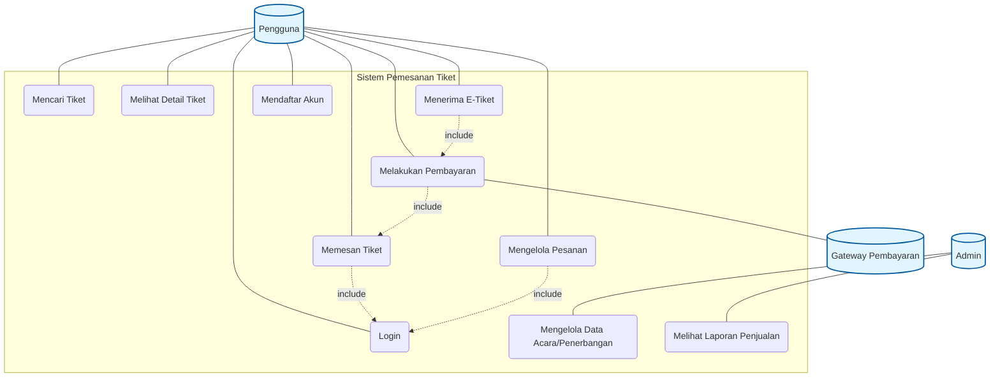
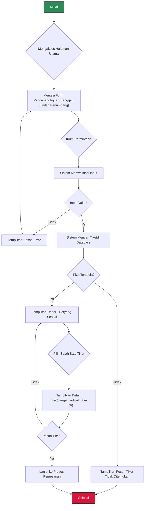
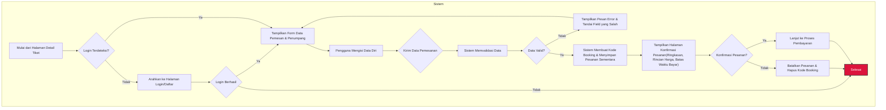
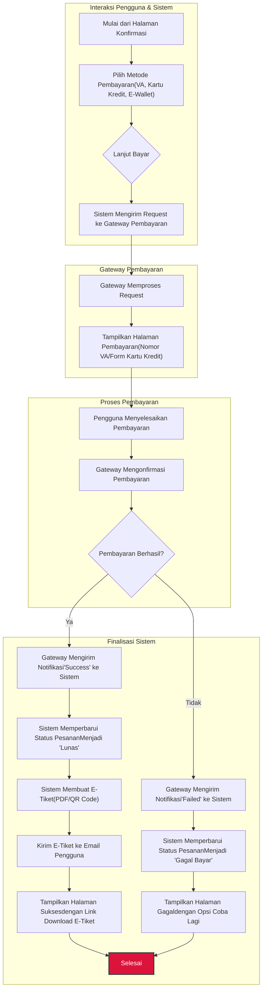
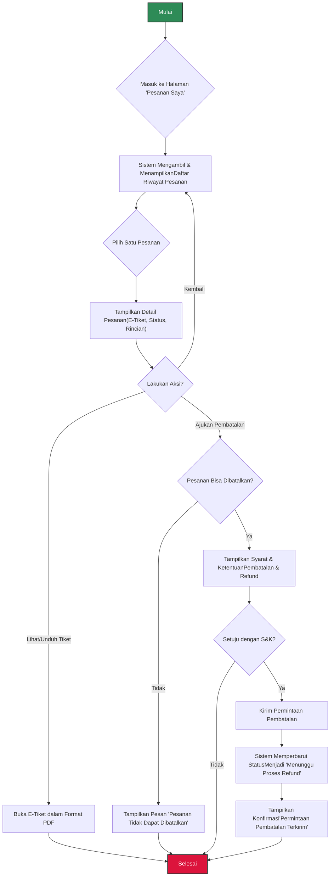
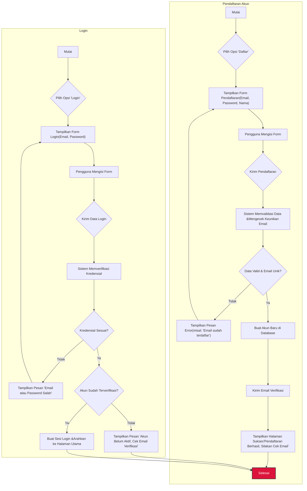

# Dokumentasi Sistem Pemesanan Tiket

Dokumen ini menjelaskan alur kerja dan interaksi dalam Sistem Pemesanan Tiket melalui diagram Use Case dan Activity Diagram.

## 1. Use Case Diagram

Diagram Use Case berikut mengilustrasikan interaksi utama antara aktor (Pengguna dan Admin) dengan fungsionalitas sistem.

### Aktor

-   **Pengguna**: Seseorang yang ingin mencari, memesan, dan membayar tiket.
-   **Admin**: Seseorang yang bertanggung jawab mengelola data acara/penerbangan dan melihat laporan.
-   **Sistem**: Entitas yang menyediakan layanan pemesanan tiket.
-   **Gateway Pembayaran**: Sistem eksternal yang memproses transaksi pembayaran.

### Deskripsi Use Case

| ID   | Use Case                          | Deskripsi Singkat                                                                |
| :--- | :-------------------------------- | :------------------------------------------------------------------------------- |
| UC1  | Mencari Tiket                     | Pengguna mencari tiket berdasarkan kriteria tertentu (misal: tujuan, tanggal).     |
| UC2  | Melihat Detail Tiket              | Pengguna melihat informasi rinci dari tiket yang dipilih.                        |
| UC3  | Memesan Tiket                     | Pengguna melakukan proses pemesanan tiket, termasuk mengisi data penumpang.      |
| UC4  | Melakukan Pembayaran              | Pengguna menyelesaikan transaksi pembayaran untuk tiket yang dipesan.            |
| UC5  | Menerima E-Tiket                  | Pengguna menerima tiket elektronik setelah pembayaran berhasil.                  |
| UC6  | Mengelola Pesanan                 | Pengguna dapat melihat riwayat atau membatalkan pesanan yang sudah dibuat.       |
| UC7  | Mendaftar Akun                    | Pengguna baru membuat akun untuk mengakses fitur yang memerlukan login.          |
| UC8  | Login                             | Pengguna masuk ke dalam sistem menggunakan kredensial yang terdaftar.            |
| UC9  | Mengelola Data Acara/Penerbangan | Admin menambah, mengubah, atau menghapus data acara/penerbangan.                 |
| UC10 | Melihat Laporan Penjualan         | Admin melihat data laporan penjualan tiket.                                      |

---

## 2. Activity Diagram

Berikut adalah penjabaran dari beberapa *use case* utama ke dalam bentuk Activity Diagram.

### 2.1. Aktivitas: Mencari dan Melihat Detail Tiket

#### Alur Proses:
1.  **Mulai**: Alur dimulai saat pengguna siap untuk mencari tiket.
2.  **Mengakses Halaman Utama**: Pengguna membuka aplikasi atau situs web sistem pemesanan tiket. Sistem menampilkan halaman utama yang berisi form pencarian.
3.  **Mengisi Form Pencarian**: Pengguna memasukkan kriteria pencarian seperti kota/stasiun/terminal tujuan, tanggal keberangkatan, dan jumlah penumpang.
4.  **Kirim Permintaan**: Pengguna menekan tombol "Cari" untuk mengirimkan data pencarian ke sistem.
5.  **Sistem Memvalidasi Input**: Sistem memeriksa apakah input yang dimasukkan oleh pengguna sudah sesuai format (misal, tanggal valid, tujuan tidak kosong).
6.  **Kondisi Input Valid?**:
    *   **Tidak**: Jika input tidak valid (misal, tanggal sudah lewat), sistem akan **Menampilkan Pesan Error** yang informatif (contoh: "Format tanggal salah"). Alur kemudian kembali ke langkah **Mengisi Form Pencarian** agar pengguna dapat memperbaiki inputnya.
    *   **Ya**: Jika input valid, proses berlanjut.
7.  **Sistem Mencari Tiket**: Sistem melakukan query ke database untuk menemukan tiket yang cocok dengan kriteria yang diberikan pengguna.
8.  **Kondisi Tiket Tersedia?**:
    *   **Tidak**: Jika tidak ada tiket yang ditemukan, sistem akan **Menampilkan Pesan "Tiket Tidak Ditemukan"** dan alur berakhir.
    *   **Ya**: Jika ada satu atau lebih tiket yang cocok, sistem akan **Menampilkan Daftar Tiket yang Sesuai**. Informasi yang ditampilkan biasanya ringkas, seperti nama maskapai/kereta, jam berangkat, dan harga.
9.  **Pilih Salah Satu Tiket**: Dari daftar yang ditampilkan, pengguna memilih satu tiket yang paling diminati untuk dilihat lebih detail.
10. **Tampilkan Detail Tiket**: Sistem menampilkan semua informasi rinci terkait tiket tersebut, seperti detail jadwal, sisa kursi yang tersedia, fasilitas, dan kebijakan pembatalan.
11. **Kondisi Pesan Tiket?**:
    *   **Tidak**: Jika pengguna tidak tertarik dan ingin melihat pilihan lain, alur kembali ke **Tampilkan Daftar Tiket**.
    *   **Ya**: Jika pengguna memutuskan untuk membeli, alur akan **Lanjut ke Proses Pemesanan**.
12. **Selesai**: Alur pencarian dan pemilihan tiket selesai, dan sistem bersiap untuk masuk ke alur pemesanan.

---

### 2.2. Aktivitas: Memesan Tiket

Diagram ini mengasumsikan pengguna sudah login. Jika belum, sistem akan meminta pengguna untuk login atau mendaftar terlebih dahulu.

#### Alur Proses:
1.  **Mulai dari Halaman Detail Tiket**: Alur ini adalah kelanjutan dari alur sebelumnya, dimana pengguna telah menekan tombol "Pesan Tiket".
2.  **Kondisi Login Terdeteksi?**: Sistem memeriksa status login pengguna.
    *   **Tidak**: Jika pengguna belum login, sistem akan **Mengarahkan ke Halaman Login/Daftar**.
        *   Jika **Login/Daftar Tidak Berhasil**, proses pemesanan dihentikan (**Selesai**).
        *   Jika **Login/Daftar Berhasil**, proses berlanjut.
    *   **Ya**: Jika pengguna sudah login, proses langsung dilanjutkan.
3.  **Tampilkan Form Data Pemesan & Penumpang**: Sistem menampilkan halaman form yang harus diisi, biasanya terdiri dari data pemesan (yang bisa jadi sama dengan data akun) dan data penumpang yang akan menggunakan tiket.
4.  **Pengguna Mengisi Data Diri**: Pengguna memasukkan semua informasi yang diperlukan, seperti nama lengkap, nomor identitas (KTP/Paspor), dan kontak.
5.  **Kirim Data Pemesanan**: Setelah semua data terisi, pengguna mengirimkannya ke sistem.
6.  **Sistem Memvalidasi Data**: Sistem kembali melakukan validasi untuk memastikan semua data yang wajib diisi sudah lengkap dan formatnya benar (misal: format email, nomor telepon).
7.  **Kondisi Data Valid?**:
    *   **Tidak**: Jika ada data yang tidak valid, sistem akan **Menampilkan Pesan Error** dan **Menandai Field yang Salah**. Alur kembali ke langkah pengisian form agar pengguna bisa memperbaikinya.
    *   **Ya**: Jika semua data valid, proses berlanjut.
8.  **Sistem Membuat Kode Booking**: Sistem menghasilkan sebuah kode booking unik untuk pesanan ini dan menyimpannya ke database dengan status "Menunggu Pembayaran". Stok tiket yang dipesan juga dikurangi sementara (di-hold).
9.  **Tampilkan Halaman Konfirmasi Pesanan**: Sistem menampilkan halaman ringkasan pesanan yang berisi semua detail: data penumpang, rincian perjalanan, total harga yang harus dibayar, dan batas waktu pembayaran.
10. **Kondisi Konfirmasi Pesanan?**: Pengguna diberikan kesempatan terakhir untuk memeriksa kembali pesanannya.
    *   **Tidak**: Jika pengguna memilih untuk membatalkan, sistem akan **Membatalkan Pesanan**, menghapus data pesanan sementara dari database, dan mengembalikan stok tiket yang tadi di-hold. Alur berakhir.
    *   **Ya**: Jika pengguna setuju dan menekan tombol "Lanjut ke Pembayaran", alur akan **Lanjut ke Proses Pembayaran**.
11. **Selesai**: Alur pemesanan tiket selesai dan sistem bersiap untuk masuk ke alur pembayaran.

---

### 2.3. Aktivitas: Melakukan Pembayaran dan Menerima E-Tiket

#### Alur Proses:
1.  **Mulai dari Halaman Konfirmasi**: Alur dimulai setelah pengguna mengonfirmasi pesanannya.
2.  **Pilih Metode Pembayaran**: Sistem menampilkan berbagai metode pembayaran yang tersedia, seperti Virtual Account (VA), Kartu Kredit, atau E-Wallet. Pengguna memilih salah satu.
3.  **Lanjut Bayar**: Pengguna menekan tombol untuk melanjutkan proses pembayaran.
4.  **Sistem Mengirim Request ke Gateway Pembayaran**: Sistem mengemas data transaksi (ID pesanan, jumlah tagihan) dan mengirimkannya ke sistem *Gateway Pembayaran* yang telah terintegrasi.
5.  **Gateway Memproses Request**: *Gateway Pembayaran* menerima permintaan dan menyiapkan sesi pembayaran.
6.  **Tampilkan Halaman Pembayaran**: Pengguna diarahkan ke halaman pembayaran yang aman milik *gateway*. Tampilan halaman ini bervariasi tergantung metode yang dipilih (misalnya, menampilkan nomor Virtual Account, form isian detail kartu kredit, atau tombol untuk membuka aplikasi E-Wallet).
7.  **Pengguna Menyelesaikan Pembayaran**: Pengguna melakukan tindakan yang diperlukan untuk membayar (misalnya, mentransfer ke nomor VA, mengisi data kartu dan OTP, atau mengonfirmasi di aplikasi E-Wallet).
8.  **Gateway Mengonfirmasi Pembayaran**: *Gateway* memproses transaksi dan mendapatkan status akhir dari bank atau E-Wallet.
9.  **Kondisi Pembayaran Berhasil?**:
    *   **Ya (Success)**:
        10. **Gateway Mengirim Notifikasi 'Success'**: *Gateway* mengirimkan notifikasi *callback* (webhook) ke sistem pemesanan tiket bahwa pembayaran untuk ID pesanan terkait telah berhasil.
        11. **Sistem Memperbarui Status Pesanan**: Sistem menerima notifikasi, memverifikasinya, lalu mengubah status pesanan dari 'Menunggu Pembayaran' menjadi 'Lunas'.
        12. **Sistem Membuat E-Tiket**: Sistem secara otomatis menghasilkan tiket elektronik, biasanya dalam format PDF yang berisi detail perjalanan, data penumpang, dan QR code untuk validasi.
        13. **Kirim E-Tiket ke Email Pengguna**: E-tiket yang sudah jadi dikirimkan sebagai lampiran ke alamat email terdaftar milik pengguna.
        14. **Tampilkan Halaman Sukses**: Pengguna diarahkan kembali ke halaman pada situs/aplikasi yang memberitahukan transaksi berhasil, seringkali disertai tombol untuk mengunduh e-tiket secara langsung.
        15. Alur berakhir dengan sukses (**Selesai**).
    *   **Tidak (Failed/Expired)**:
        16. **Gateway Mengirim Notifikasi 'Failed'**: Jika pembayaran gagal (misal, salah OTP, dana tidak cukup) atau melewati batas waktu, *gateway* akan mengirim notifikasi kegagalan ke sistem.
        17. **Sistem Memperbarui Status Pesanan**: Status pesanan diubah menjadi 'Gagal Bayar' atau 'Dibatalkan'. Sistem juga mengembalikan stok tiket yang sebelumnya di-hold.
        18. **Tampilkan Halaman Gagal**: Pengguna diarahkan ke halaman yang menyatakan pembayaran gagal, seringkali dengan opsi untuk mencoba membayar lagi atau kembali ke halaman pesanan.
        19. Alur berakhir (**Selesai**).

---

### 2.4. Aktivitas: Mengelola Pesanan

#### Alur Proses:
1.  **Mulai**: Pengguna ingin melihat atau mengelola pesanan yang pernah dibuat.
2.  **Masuk ke Halaman 'Pesanan Saya'**: Pengguna mengakses menu atau halaman yang didedikasikan untuk riwayat transaksi, biasanya memerlukan login.
3.  **Sistem Menampilkan Daftar Riwayat Pesanan**: Sistem mengambil data semua pesanan yang terkait dengan akun pengguna dari database dan menampilkannya dalam bentuk daftar. Informasi yang ditampilkan biasanya mencakup ID Pesanan, tanggal, tujuan, dan status (misal: Lunas, Dibatalkan, Selesai).
4.  **Pilih Satu Pesanan**: Pengguna memilih salah satu pesanan dari daftar untuk melihat detailnya.
5.  **Tampilkan Detail Pesanan**: Sistem menampilkan semua informasi lengkap tentang pesanan tersebut, termasuk e-tiket yang bisa diunduh, rincian penumpang, status terakhir, dan opsi yang bisa dilakukan (misal: 'Ajukan Pembatalan').
6.  **Kondisi Lakukan Aksi?**: Pengguna memutuskan tindakan apa yang akan diambil.
    *   **Lihat/Unduh Tiket**: Jika pengguna memilih opsi ini, sistem akan **Membuka E-Tiket dalam Format PDF** di tab baru atau memicu unduhan file. Alur selesai.
    *   **Ajukan Pembatalan**: Jika pengguna memilih untuk membatalkan.
        7.  **Kondisi Pesanan Bisa Dibatalkan?**: Sistem memeriksa kebijakan pembatalan. Apakah tiket bersifat *non-refundable*? Apakah sudah melewati batas waktu pembatalan?
            *   **Tidak**: Jika tidak bisa dibatalkan, sistem akan **Menampilkan Pesan 'Pesanan Tidak Dapat Dibatalkan'**. Alur selesai.
            *   **Ya**: Jika bisa, proses berlanjut.
        8.  **Tampilkan Syarat & Ketentuan**: Sistem menampilkan informasi penting mengenai pembatalan, seperti jumlah dana yang akan dikembalikan (*refund*) dan estimasi waktu proses.
        9.  **Kondisi Setuju dengan S&K?**: Pengguna harus menyetujui syarat dan ketentuan tersebut.
            *   **Tidak**: Jika pengguna tidak setuju, proses pembatalan berhenti. Alur selesai.
            *   **Ya**: Jika pengguna setuju, proses berlanjut.
        10. **Kirim Permintaan Pembatalan**: Pengguna mengonfirmasi pengajuan pembatalan.
        11. **Sistem Memperbarui Status**: Status pesanan di database diubah menjadi 'Menunggu Proses Refund' atau status sejenis. Proses pengembalian dana biasanya ditangani secara terpisah (bisa otomatis atau manual oleh tim keuangan).
        12. **Tampilkan Konfirmasi**: Sistem menampilkan pesan bahwa permintaan pembatalan telah berhasil dikirim dan akan segera diproses. Alur selesai.
    *   **Kembali**: Jika pengguna hanya ingin melihat-lihat, mereka bisa kembali ke daftar riwayat pesanan.
7.  **Selesai**: Alur pengelolaan pesanan untuk satu sesi selesai.

---

### 2.5. Aktivitas: Mendaftar Akun dan Login

#### Alur Proses Pendaftaran:
1.  **Mulai**: Pengguna baru ingin membuat akun.
2.  **Pilih Opsi 'Daftar'**: Pengguna memilih tombol atau tautan untuk mendaftar.
3.  **Tampilkan Form Pendaftaran**: Sistem menampilkan form yang meminta data-data esensial seperti nama, alamat email, dan kata sandi.
4.  **Pengguna Mengisi Form**: Pengguna memasukkan data yang diminta.
5.  **Kirim Pendaftaran**: Pengguna mengirimkan form pendaftaran.
6.  **Sistem Memvalidasi Data & Mengecek Keunikan Email**: Sistem memeriksa validitas input (misal: format email, kekuatan password) dan yang terpenting, memastikan belum ada akun lain yang menggunakan email tersebut.
7.  **Kondisi Data Valid & Email Unik?**:
    *   **Tidak**: Jika data tidak valid atau email sudah terdaftar, sistem akan **Menampilkan Pesan Error** yang spesifik dan mengembalikan pengguna ke form pendaftaran.
    *   **Ya**: Jika semua syarat terpenuhi, proses berlanjut.
8.  **Buat Akun Baru di Database**: Sistem menyimpan data pengguna baru ke dalam database dengan status 'Belum Terverifikasi'.
9.  **Kirim Email Verifikasi**: Sistem mengirimkan email ke alamat yang didaftarkan. Email ini berisi tautan unik untuk mengaktifkan akun.
10. **Tampilkan Halaman Sukses**: Pengguna melihat pesan bahwa pendaftaran berhasil dan diminta untuk memeriksa email untuk verifikasi.
11. **Selesai**: Alur pendaftaran selesai.

#### Alur Proses Login:
1.  **Mulai**: Pengguna yang sudah terdaftar ingin masuk ke sistem.
2.  **Pilih Opsi 'Login'**: Pengguna memilih tombol atau tautan untuk masuk.
3.  **Tampilkan Form Login**: Sistem menampilkan form yang meminta email dan kata sandi.
4.  **Pengguna Mengisi Form**: Pengguna memasukkan kredensialnya.
5.  **Kirim Data Login**: Pengguna mengirimkan form login.
6.  **Sistem Memverifikasi Kredensial**: Sistem membandingkan email dan hash kata sandi yang dimasukkan dengan data yang ada di database.
7.  **Kondisi Kredensial Sesuai?**:
    *   **Tidak**: Jika email tidak ditemukan atau kata sandi salah, sistem akan **Menampilkan Pesan 'Email atau Password Salah'** dan mengembalikan pengguna ke form login.
    *   **Ya**: Jika kredensial cocok, sistem melakukan pemeriksaan lanjutan.
8.  **Kondisi Akun Sudah Terverifikasi?**: Sistem memeriksa status akun.
    *   **Tidak**: Jika akun masih berstatus 'Belum Terverifikasi', sistem akan **Menampilkan Pesan 'Akun Belum Aktif'** dan menyarankan untuk memeriksa email verifikasi. Login tidak dilanjutkan.
    *   **Ya**: Jika akun sudah aktif.
9.  **Buat Sesi Login & Arahkan ke Halaman Utama**: Sistem membuat sesi (session) untuk pengguna tersebut, yang menandakan bahwa ia sudah diautentikasi, lalu mengarahkannya ke halaman utama (dashboard) sebagai pengguna yang telah login.
10. **Selesai**: Alur login berhasil.

--- 
